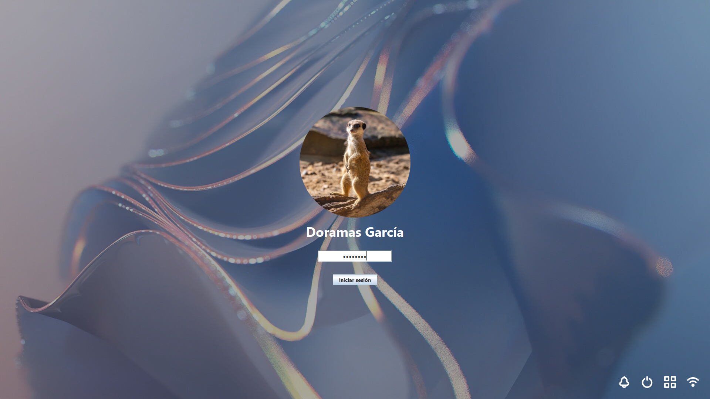
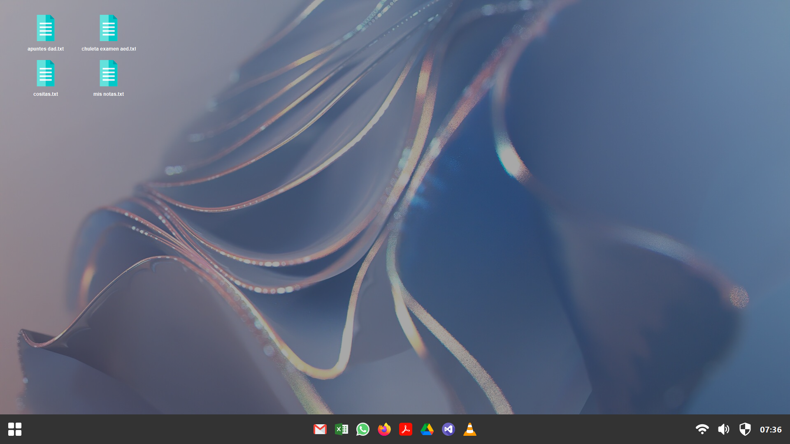
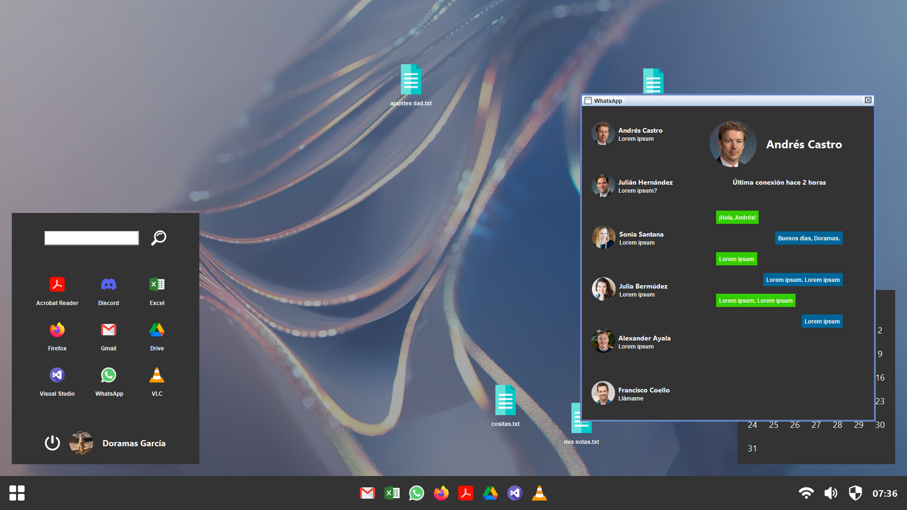
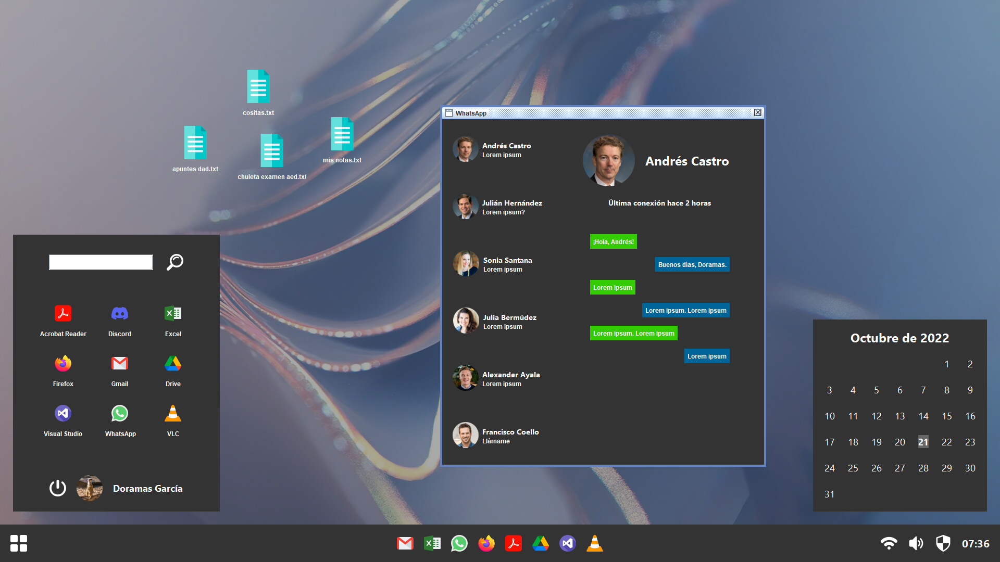

# DoramOS
DoramOS is a simple GUI imitation of a desktop operating system. It uses Java and Swing.

You can login and open/move different windows.

> [!NOTE]  
> This app was made when I was a student and had a tight deadline, so don't expect quality code or features. 

# Images

